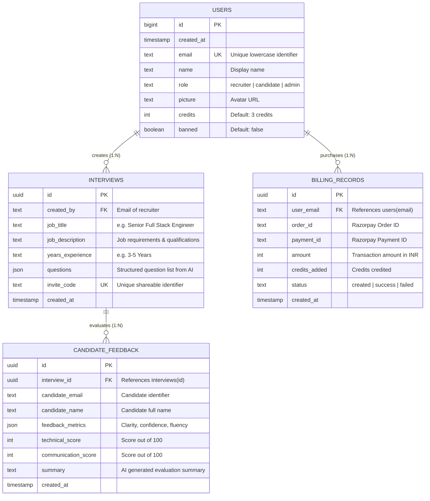
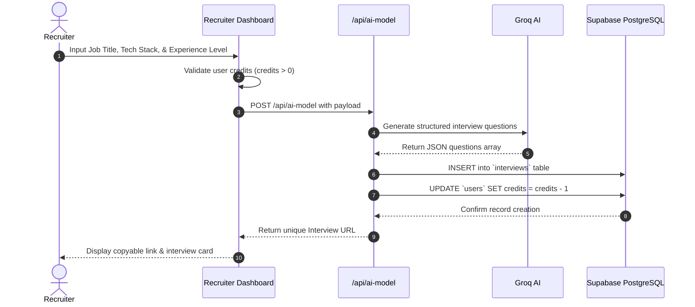
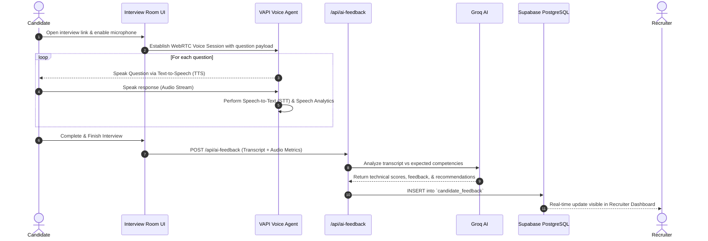

# 🏗️ Career-Mock AI Voice Interview Platform — Complete System Architecture

## 1. Executive Summary

**Career-Mock** is an automated, AI-powered voice interview platform engineered to bridge the gap between traditional recruitment workflows and intelligent automated screening. The platform leverages **Next.js 15 (React 18)**, **Supabase PostgreSQL & Auth**, **VAPI Real-Time Voice WebRTC/STT/TTS**, **Groq / OpenRouter LLMs**, and **Razorpay Payment Gateway** to provide an end-to-end interview simulation, scoring, and analytics ecosystem.

---

## 2. High-Level 4-Tier Architecture Diagram

```mermaid
graph TD
    subgraph Tier1 ["1. Client / Presentation Layer (Next.js 15 + React 18)"]
        Landing["🌐 Landing Page & Auth Portals (/login, /register)"]
        Recruiter_UI["👔 Recruiter Dashboard (/recruiter/*)"]
        Candidate_UI["🧑‍💼 Candidate Voice Room (/interview/[id]/*)"]
        Admin_UI["🧑‍💻 Admin Operations Panel (/admin/*)"]
    end

    subgraph Tier2 ["2. Application & API Routing Layer (Next.js Route Handlers)"]
        API_Auth["Session & Role Manager (AuthContext / provider.jsx)"]
        API_AI_Model["POST /api/ai-model (Question Generation)"]
        API_AI_Feedback["POST /api/ai-feedback (Response Evaluation)"]
        API_Daily["POST /api/create-daily-room (WebRTC Rooms)"]
        API_Razorpay["POST /api/razorpay (Billing & Orders)"]
        API_Webhook["POST /api/razorpay-webhook (Payment Verification)"]
        API_Admin["POST /api/admin/* (User Moderation)"]
    end

    subgraph Tier3 ["3. AI & Voice Intelligence Infrastructure"]
        VAPI_Engine["🗣️ VAPI Voice AI (WebSockets / WebRTC Audio Streaming)"]
        Groq_LLM["🧠 Groq AI / OpenRouter (LLaMA 3 / Mixtral / GPT)"]
    end

    subgraph Tier4 ["4. Data & Persistence Layer (Supabase BaaS)"]
        S_Auth["🔐 Supabase Auth (JWT, OAuth 2.0, Row Level Security)"]
        S_DB[("🗄️ PostgreSQL Database\n• users\n• interviews\n• candidate_feedback\n• billing_records")]
        S_Storage["📁 Supabase Storage Buckets (CVs, Avatars, Recordings)"]
    end

    subgraph Tier5 ["5. External SaaS Services"]
        Daily_Svc["📹 Daily.co (Video/Audio Infrastructure)"]
        Razorpay_Svc["💳 Razorpay Payment Gateway"]
        Email_Svc["✉️ EmailJS / Nodemailer (Transational Notifications)"]
    end

    %% Interactions
    Landing --> API_Auth
    Recruiter_UI --> API_AI_Model
    Recruiter_UI --> API_Razorpay
    Candidate_UI --> VAPI_Engine
    Candidate_UI --> API_Daily
    Admin_UI --> API_Admin

    API_Auth --> S_Auth
    API_AI_Model --> Groq_LLM
    API_AI_Feedback --> Groq_LLM
    API_Daily --> Daily_Svc
    API_Razorpay --> Razorpay_Svc
    API_Webhook --> S_DB

    API_AI_Model --> S_DB
    API_AI_Feedback --> S_DB
    Recruiter_UI --> S_DB
    Candidate_UI --> S_DB
    Admin_UI --> S_DB
```

---

## 3. Component-Level Decomposition

### 🖥️ 3.1 Client Layer (Frontend)
Built using **Next.js 15 App Router** and **Tailwind CSS** with **Radix UI** primitives and **Framer Motion**:
- **Authentication Views** (`/login`, `/register`, `/forgot-password`, `/auth/callback`): Dynamic role-based registration and Google OAuth callback handling.
- **Recruiter Dashboard** (`/recruiter/dashboard`, `/recruiter/all-interview`, `/recruiter/billing`, `/recruiter/profile`):
  - AI Question Generator interface.
  - Candidate response analytics, audio playback, and scorecards.
  - Credit purchasing and billing ledger.
- **Candidate Room** (`/interview/[interview_id]`, `/interview/[interview_id]/start`):
  - Hardware microphone permission checks and ambient noise detection.
  - Live audio visualizer and conversational agent interface.
  - Post-interview submission screen.
- **Admin Dashboard** (`/admin`, `/admin/users`, `/admin/interviews`):
  - Platform-wide user metrics, recruiter credit overrides, and ban/moderation management.

---

### ⚙️ 3.2 Application & API Routing Layer (Next.js Serverless Routes)
- **`/api/ai-model`**: Accepts role criteria (e.g. Job Title, Experience Level, Tech Stack, Number of Questions) and orchestrates prompt engineering to Groq/OpenRouter, enforcing structured JSON output.
- **`/api/ai-feedback`**: Ingests candidate conversation transcripts, evaluates technical accuracy, relevance, and communication tone, returning scored rubrics (0–100) and bulleted suggestions.
- **`/api/create-daily-room`**: Creates secure, ephemeral video/audio communication rooms via the Daily.co API.
- **`/api/razorpay`**: Secure server-side order generation for credit pack purchases.
- **`/api/razorpay-webhook`**: HMAC SHA-256 cryptographic verification of payment events to increment recruiter credits.

---

### 🧠 3.3 AI & Voice Processing Engine
1. **Speech-to-Text (STT) & Audio Streaming (VAPI)**:
   - High-performance, low-latency bidirectional WebRTC connection.
   - Automatically handles interruptions, pauses, and voice activity detection (VAD).
2. **LLM Inference (Groq AI / OpenRouter)**:
   - Ultra-fast token generation using high-throughput Groq LPU inference.
   - Formats evaluation matrices with strict schema validation.

---

### 🗄️ 3.4 Data & Persistence Layer (Supabase PostgreSQL)

---

## 4. End-to-End System Workflows

### 🔄 4.1 Recruiter Interview Creation Pipeline

### 🎙️ 4.2 Candidate Voice Interview & Feedback Pipeline

---

## 5. Security & Authentication Architecture

1. **Authentication & Session State**:
   - Supabase Auth manages sessions with secure HTTP-only cookies and automatic token refresh (`detectSessionInUrl: true`).
   - Role persistence guarantees synchronized states between `auth.users.raw_user_meta_data` and `public.users.role`.
2. **Access Control (RBAC)**:
   - Context providers (`AuthContext`, `UserDetailContext`) enforce path protection across `/recruiter/*`, `/candidate/*`, and `/admin/*`.
   - Banned accounts are checked on every sign-in attempt and immediately logged out.
3. **Data Integrity & Payment Security**:
   - Razorpay webhook verification uses HMAC SHA-256 signature matching before allocating recruiter credits.
   - API keys (`OPENROUTER_API_KEY`, `GROQ_API_KEY`, `DAILY_API_KEY`) are protected on the server side and never exposed to client bundles.

---

## 6. Deployment & Infrastructure Matrix

| Layer | Hosting / Provider | Environment Config |
|---|---|---|
| **Frontend & API Routes** | **Vercel Edge & Serverless Network** | Next.js 15 App Router |
| **Database & Auth** | **Supabase (AWS Cloud)** | Managed PostgreSQL 15 |
| **Voice Streaming** | **VAPI Cloud Infrastructure** | Global WebRTC / WebSocket mesh |
| **LLM Inference** | **Groq LPU Cloud / OpenRouter** | Ultra low-latency token generation |
| **Payment Gateway** | **Razorpay** | PCI-DSS Compliant Payment Gateway |
